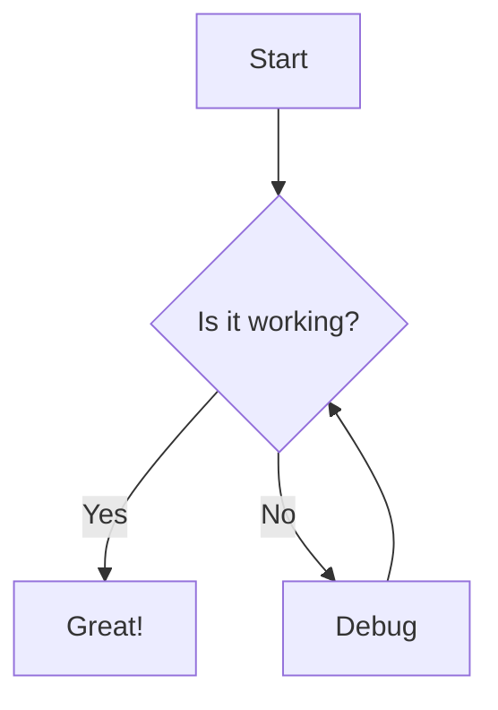
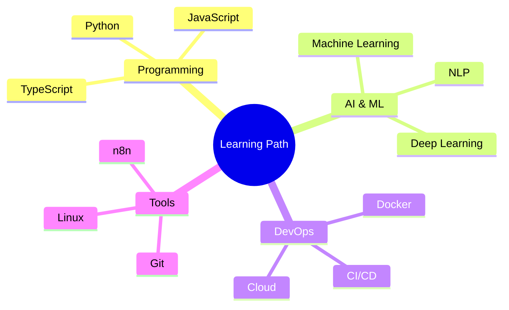
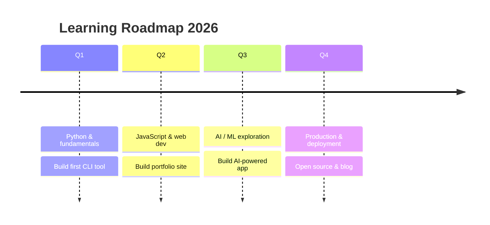
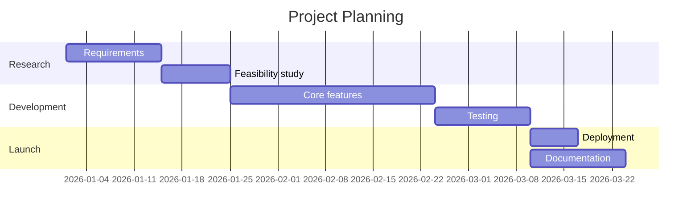

# Heading 1
## Heading 2
### Heading 3
#### Heading 4
##### Heading 5
###### Heading 6

## Text Formatting

**Bold text**, *italic text*, ***bold italic***, ~~strikethrough~~, `inline code`, <mark>highlighted text</mark>, and combined **bold with *nested italic***.

**Keyboard shortcuts:** Press <kbd>Ctrl</kbd> + <kbd>C</kbd> to copy, <kbd>Ctrl</kbd> + <kbd>V</kbd> to paste. Use <kbd>F11</kbd> for fullscreen.

## Links

- [External link](https://github.com/wahyusd)
- [Link to homepage](/)
- [Link to projects](/pages/projects/)
- Email: <dianwahyusap@gmail.com>

## Images

### Standard Markdown (alt text bawaan)

Alt text hanya terlihat saat gambar **gagal dimuat** atau dibaca oleh screen reader:


### Gambar dengan Keterangan Tetap (Figure + Figcaption)

Gunakan raw HTML `<figure>` + `<figcaption>` agar teks keterangan selalu terlihat di bawah gambar. Tambahkan class `caption-center` atau `caption-left` untuk mengatur perataan.

<figure>
  
  <figcaption class="caption-center">Keterangan rata tengah — menggunakan <code>class="caption-center"</code> pada <code>&lt;figcaption&gt;</code>.</figcaption>
</figure>

<figure>
  
  <figcaption class="caption-left">Keterangan rata kiri — menggunakan <code>class="caption-left"</code>. Cocok untuk deskripsi panjang yang butuh lebih dari satu baris seperti ini.</figcaption>
</figure>

### Gambar Lokal dari Repository

<figure>
  
  <figcaption class="caption-center">WS Downloader — aplikasi desktop download manager. Simpan screenshot di <code>assets/images/learning/</code>.</figcaption>
</figure>

### Gambar Rusak / Gagal Load (fallback otomatis)

Saat file gambar tidak ditemukan, atribut `onerror` mengganti src dengan placeholder:

<figure>
  
  <figcaption class="caption-center">Gambar gagal dimuat → <code>onerror</code> mengganti dengan placeholder abu-abu. Alt text tetap terbaca screen reader.</figcaption>
</figure>

> **Best Practice:** Selalu isi `alt="deskripsi singkat"` pada setiap ``. Alt text wajib untuk aksesibilitas (screen reader) dan menjadi fallback teks saat gambar gagal load. Jangan gunakan alt text kosong (`alt=""`) untuk gambar informatif.

### Teks di Tengah Gambar (Image Overlay)

Bungkus gambar dan teks overlay dalam container dengan class `img-overlay`:

<div class="img-overlay">
  
  <div class="img-overlay-text">
    Judul di Tengah Gambar
    <small>Subtitle atau keterangan tambahan di bawahnya</small>
  </div>
</div>

## YouTube Embed (raw HTML)

<figure>
  <iframe width="100%" height="400" src="https://www.youtube.com/embed/dQw4w9WgXcQ" title="YouTube video" frameborder="0" allow="accelerometer; autoplay; clipboard-write; encrypted-media; gyroscope; picture-in-picture" allowfullscreen style="border-radius:10px;"></iframe>
  <figcaption class="caption-center">YouTube video — bisa dibungkus <code>&lt;figure&gt;</code> + <code>&lt;figcaption&gt;</code> seperti gambar.</figcaption>
</figure>

## Lists

### Unordered
- Item one
- Item two
  - Nested item A
  - Nested item B
- Item three

### Ordered
1. First step
2. Second step
   1. Sub-step A
   2. Sub-step B
3. Third step

### Task List (GFM)
- [x] Completed task
- [ ] Pending task
- [ ] Another pending task

## Code Blocks

**JavaScript:**
```javascript
function greet(name) {
    return `Hello, ${name}!`;
}
console.log(greet("World"));
```

**Python:**
```python
def analyze_sentiment(text):
    positive_words = ["good", "great", "awesome"]
    words = text.lower().split()
    score = sum(1 for w in words if w in positive_words)
    return score
```

**Bash:**
```bash
# Install dependencies
npm install
pip install -r requirements.txt
```

## Blockquotes

> Single line blockquote.

> Multi-line blockquote.
>
> This is the second paragraph.
>
> > Nested blockquote.

## Tables

| Feature | Status | Notes |
|---------|--------|-------|
| Markdown | ✅ Done | Full GFM support |
| Images | ✅ Done | Online, local, caption, fallback, overlay |
| YouTube | ✅ Done | Via raw HTML iframe |
| Mermaid Diagrams | ✅ Done | Flowchart, mindmap, timeline, gantt |
| Raw HTML | ✅ Done | Figure, details, div, iframe, dl |
| Keyboard / Highlight | ✅ Done | kbd, mark tags |

## Horizontal Rules

---

## Definition List (via raw HTML)

<dl>
  <dt><strong>Markdown</strong></dt>
  <dd>A lightweight markup language for formatting text.</dd>
  <dt><strong>GFM</strong></dt>
  <dd>GitHub Flavored Markdown — an extended version with tables, task lists, etc.</dd>
</dl>

## Details / Spoiler (raw HTML)

<details>
  <summary>Click to expand</summary>

  This content is hidden by default. You can put anything here — code, images, tables, etc.

  ```javascript
  console.log("Hidden code block");
  ```
</details>

## Mixed Content Example

Here's a card layout using raw HTML — useful for showcasing tips or callouts:

<div style="background:var(--bg-surface);border:1px solid var(--border-color);border-radius:12px;padding:2rem;margin:2rem 0;border-left:4px solid var(--color-primary);">
  <strong style="color:var(--color-primary);font-size:1.3rem;">💡 TIP</strong>
  <p style="margin-top:0.8rem;color:var(--text-muted);">You can mix raw HTML with Markdown for more complex layouts. This works because <code>marked.js</code> passes HTML through as-is.</p>
</div>

---

## Diagrams (Mermaid.js)

Diagram berikut dirender langsung oleh Mermaid.js — didukung saat dilihat di halaman Learning.

### Flowchart



### Mindmap



### Timeline / Roadmap



### Gantt Chart



---

*Last updated: 2026*
