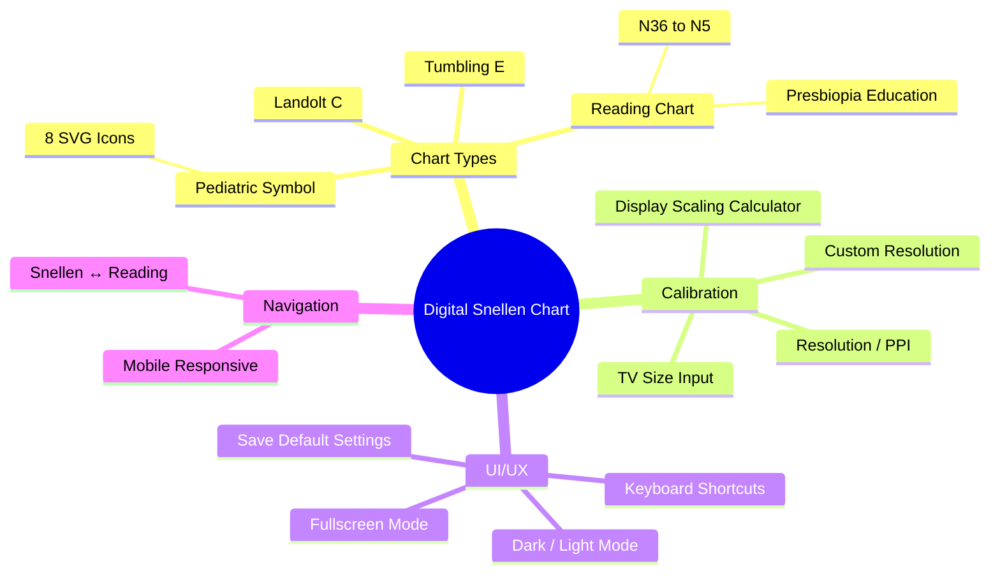
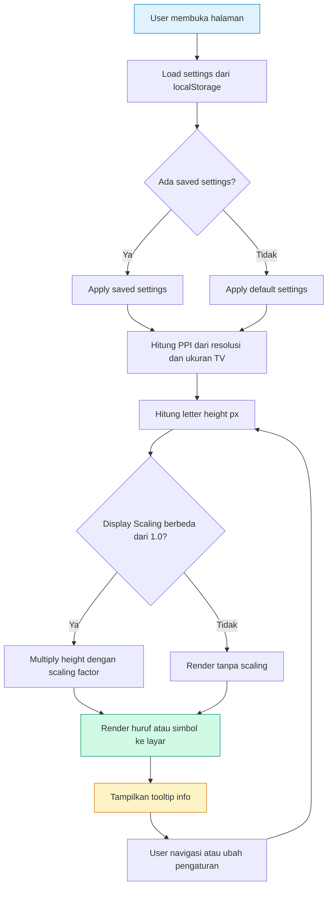
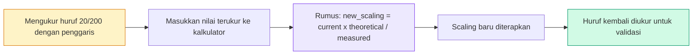
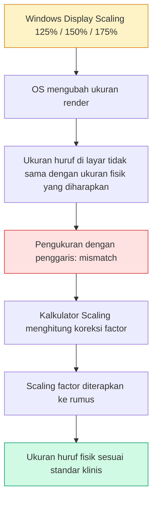
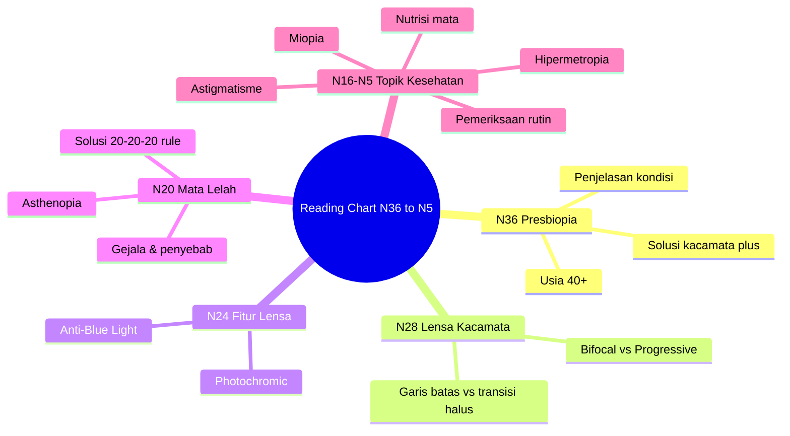
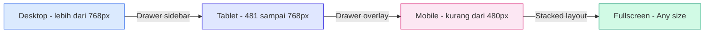
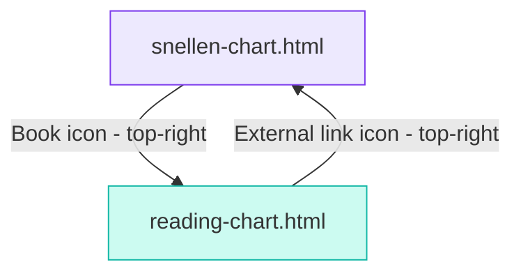

# Digital Snellen Chart: Membuat Uji Penglihatan Digital yang Akurat dan Terjangkau

> **White Paper** | Wahyu Saputra | 2026
> *Sebuah studi tentang implementasi chart Snellen digital berbasis web dengan kalibrasi presisi untuk penggunaan pribadi dan edukatif.*

---

## Daftar Isi

1. [Abstrak](#abstrak)
2. [Pendahuluan](#pendahuluan)
3. [Masalah & Kebutuhan](#masalah--kebutuhan)
4. [Solusi yang Dirancang](#solusi-yang-dirancang)
5. [Arsitektur & Alur Kerja](#arsitektur--alur-kerja)
6. [Aspek Klinis: Rumus & Kalibrasi](#aspek-klinis-rumus--kalibrasi)
7. [Reading Chart & Presbiopia](#reading-chart--presbiopia)
8. [Implementasi Teknis](#implementasi-teknis)
9. [UX & Responsive Design](#ux--responsive-design)
10. [Kesimpulan](#kesimpulan)
11. [Referensi](#referensi)

---

## Abstrak

Digital Snellen Chart adalah aplikasi web mandiri (*single-file HTML*) yang menyediakan uji penglihatan jarak dekat dan jauh dengan tingkat akurasi klinis. Aplikasi ini mendukung empat jenis chart — Tumbling E, Landolt C, Pediatric Symbol, dan Reading Chart — dilengkapi dengan sistem kalibrasi yang mengkompensasi perbedaan perangkat seperti ukuran layar, resolusi, dan Display Scaling pada Windows.

> [!info] Ringkasan
> **Pengembang:** Wahyu Saputra (pengalaman optik sejak 2017)
> **Stack:** HTML + CSS + JavaScript (tanpa framework)
> **Deployment:** GitHub Pages
> **Target:** Penggunaan pribadi, edukasi, dan uji coba kasar

---

## Pendahuluan

Uji penglihatan menggunakan chart Snellen adalah prosedur standar dalam praktik optometri dan oftalmologi. Secara tradisional, chart cetak dipasang pada jarak tertentu dari pasien. Namun, di era digital, muncul kebutuhan untuk memiliki chart yang dapat ditampilkan pada layar — baik TV monitor maupun perangkat mobile — dengan ukuran yang tetap akurat secara klinis.

> [!note] Konteks
> Project ini lahir dari kebutuhan pribadi Saya sebagai praktisi optik sejak 2017, sekaligus menjadi bagian dari serial *vibe coding* — pendekatan pengembangan di mana AI agent membantu mewujudkan ide menjadi kode secara iteratif.

---

## Masalah & Kebutuhan

### Mengapa Membuat dari Nol?

Beberapa alasan mendasari mengapa chart Snellen digital yang sudah ada di pasaran belum memenuhi kebutuhan:

| No | Masalah | Penjelasan |
|----|---------|------------|
| 1 | **Asal-usul tidak jelas** | Banyak aplikasi chart digital yang tidak diketahui sumber kodenya, sehingga sulit memastikan akurasi dan legalitas |
| 2 | **Kurangnya kalibrasi** | Jarang ada aplikasi yang menyediakan mekanisme kompensasi terhadap Display Scaling Windows |
| 3 | **Tidak fleksibel** | Sedikit yang mendukung beberapa jenis chart sekaligus (Tumbling E, Landolt C, Pediatric, Reading) |
| 4 | **Ketergantungan framework** | Banyak solusi menggunakan framework berat yang tidak praktis untuk deployment sederhana |

> [!warning] Risiko Penggunaan
> Menggunakan aplikasi dengan sumber kode yang tidak diketahui berisiko terhadap akurasi ukuran huruf yang ditampilkan — krusial dalam konteks pengukuran klinis.

---

## Solusi yang Dirancang

### Fitur Utama



<figcaption><em>Gambar 1 — Mindmap fitur utama Digital Snellen Chart</em></figcaption>

### Perbandingan dengan Solusi Lain

| Aspek | Chart Cetak | App Umum | **Digital Snellen** |
|-------|:-----------:|:--------:|:-------------------:|
| Akurasi ukuran | ✅ Standar | ⚠️ Bergantung perangkat | ✅ + Kalibrasi |
| Compensasi Scaling | ❌ | ❌ | ✅ |
| Multiple chart types | ❌ | ⚠️ | ✅ 4 jenis |
| Pediatric symbols | ❌ | ⚠️ | ✅ 8 simbol SVG |
| Reading chart edukatif | ❌ | ❌ | ✅ + presbiopia info |
| Offline / no install | ✅ | ⚠️ | ✅ Single HTML file |
| Open source | ❌ | ⚠️ | ✅ GitHub Pages |

---

## Arsitektur & Alur Kerja

### Alur Render Chart



<figcaption><em>Gambar 2 — Alur kerja rendering chart dari loading hingga tampilan</em></figcaption>

### Alur Kalibrasi Display Scaling



<figcaption><em>Gambar 3 — Alur kalibrasi Display Scaling menggunakan kalkulator bawaan</em></figcaption>

---

## Aspek Klinis: Rumus & Kalibrasi

### Rumus Tinggi Huruf

Rumus utama yang digunakan untuk menghitung tinggi huruf dalam satuan milimeter:

```
height_mm = factor × (distance_m / 6.0) × 1.45444 × scaling
```

Di mana:
- **factor** = nilai yang merepresentasikan ukuran huruf (misal: 60 untuk 20/200, 7.5 untuk 20/20)
- **distance_m** = jarak penglihatan dalam meter
- **1.45444** = konstanta konversi sudut visual ke ukuran linear
- **scaling** = faktor kompensasi Display Scaling

> [!tip] Konversi ke Piksel
> Setelah mendapatkan `height_mm`, konversi ke piksel menggunakan:
> ```
> height_px = height_mm / (25.4 / PPI)
> ```
> Di mana **PPI** (Pixels Per Inch) dihitung dari resolusi layar dan ukuran TV.

### Mengapa Scaling Factor Diperlukan?



<figcaption><em>Gambar 4 — Mengapa Display Scaling Windows menjadi masalah dan bagaimana kalibrasi mengatasinya</em></figcaption>

> [!important] Standar ISO 10938
> Rumus yang digunakan merujuk pada pendekatan standar ISO 10938 untuk chart penglihatan. Kalkulator internal secara otomatis mempertimbangkan scaling yang sedang aktif, sehingga pengguna tidak perlu menghitung manual.

---

## Reading Chart & Presbiopia

### Apa itu Presbiopia?

Presbiopia adalah penurunan kemampuan akomodasi mata akibat penuaan lensa. Kondisi ini dialami oleh hampir semua manusia mulai usia **40 tahun ke atas**.

> [!info] Fakta Klinis
> - Lensa mata kehilangan kelenturan seiring waktu
> - Gejala: kesulitan membaca huruf kecil, harus menjauhkan bacaan
> - **Bukan penyakit** — bagian natural dari penuaan
> - Solusi: kacamata plus, lensa bifocal, atau progressive

### Konten Edukatif dalam Reading Chart

Reading chart ini tidak hanya menguji penglihatan, tetapi juga menyampaikan edukasi kepada pasien:



<figcaption><em>Gambar 5 — Struktur edukasi yang terintegrasi dalam setiap baris reading chart</em></figcaption>

### Mengapa Jarak 30cm?

Jarak baku reading chart diatur ke **30cm** karena:
- Jarak membaca normal saat menggunakan lensa multifokal atau lensa plus adalah **30–40cm**
- Pengguna dapat menyesuaikan jarak (10–80cm) sesuai kebutuhan
- Semua kalkulasi ukuran huruf otomatis menyesuaikan berdasarkan jarak yang diatur

---

## Implementasi Teknis

### Single-File Architecture

Seluruh aplikasi — HTML, CSS, dan JavaScript — dikemas dalam **satu file HTML** saja.

> [!note] Filosofi Single-File
> Meskipun awalnya tidak direncanakan, pendekatan single-file terbukti memiliki keuntungan:
> - **Deployment instal** — cukup upload satu file ke GitHub Pages
> - **Tidak ada build process** — langsung bisa dibuka di browser
> - **Portabilitas** — bisa dibuka offline, dikirim via USB, atau ditanam di sistem klinik

### SVG Pediatric Symbols

Delapan simbol pediatric dipilih melalui riset elaborasi menggunakan AI:

| No | Simbol | Asal SVG | Keterangan |
|----|--------|----------|------------|
| 1 | 🍎 Apel | Lucide Icons | Path ganda (body + leaf) |
| 2 | 🏠 Rumah | Lucide Icons | Path ganda (body + chimney) |
| 3 | ⭐ Bintang | Lucide Icons | 5-point star |
| 4 | ❤️ Hati | Lucide Icons | Heart shape |
| 5 | 🌙 Bulan | Lucide Icons | Crescent moon |
| 6 | ⭕ Lingkaran | Lucide Icons | Circle |
| 7 | 🟥 Persegi | Lucide Icons | Square |
| 8 | 🔺 Segitiga | Lucide Icons | Triangle |

> [!note] Pendekatan SVG
> Setiap simbol menggunakan viewBox `24×24` dari referensi Lucide. Fungsi `makePediatricSVG()` mendukung array path (beberapa ikon memiliki path ganda) yang digabung dengan `fill-rule="evenodd"`.

### Tantangan Teknis

| Tantangan | Solusi |
|-----------|--------|
| **Ukuran kode sangat besar** (single-file) | Dikelola dengan struktur section yang jelas dalam HTML |
| **Akurasi antar perangkat** | Sistem kalibrasi scaling + kalkulator bawaan |
| **Reading chart di mobile** | Responsive design khusus, scrolling body, fixed nav buttons |
| **11 paragraf edukatif panjang** | Layout single-row view dengan word-wrap dan overflow handling |
| **Simbol pediatric acak muncul berurutan** | Predefined array per baris (bukan random) |

---

## UX & Responsive Design

### Breakpoint Strategy



<figcaption><em>Gambar 6 — Strategi breakpoint responsive design</em></figcaption>

### Navigasi Antar Chart



<figcaption><em>Gambar 7 — Navigasi antara Snellen Chart dan Reading Chart</em></figcaption>

> [!tip] UX Navigation
> Tombol navigasi ditempatkan di pojok kanan atas dengan posisi fixed, disembunyikan saat mode fullscreen untuk tidak mengganggu fokus pengguna saat uji penglihatan.

### Mobile-First Considerations

- **Reading chart** memang dirancang untuk dibaca jarak dekat — **mobile adalah platform utama**, bukan TV lebar
- **Tombol prev/next** menggunakan `position: fixed` agar tetap terlihat saat scrolling konten panjang
- **Tooltip info** diizinkan wrap di mobile agar tidak keluar layar
- **Statusbar** menggunakan `position: sticky; bottom: 0` agar selalu terlihat

---

## Kesimpulan

Digital Snellen Chart berhasil dibangun sebagai aplikasi web mandiri yang:

1. ✅ Menyediakan **empat jenis chart** penglihatan dalam satu platform
2. ✅ Memiliki **sistem kalibrasi** yang mengkompensasi Display Scaling
3. ✅ Mendukung **pediatric symbols** dengan 8 ikon SVG yang konsisten
4. ✅ Menyertakan **reading chart edukatif** dengan informasi presbiopia dan lensa
5. ✅ Berjalan **offline** sebagai single-file HTML tanpa dependensi
6. ✅ **Responsive** untuk desktop, tablet, dan mobile

> [!note] Status Saat Ini
> Project ini masih dalam tahap **uji coba pribadi** dan belum divalidasi secara klinis. Rencana ke depan adalah mengunggah ke **GitHub Pages** sebagai open source agar dapat dimanfaatkan lebih luas.

---

## Referensi

- ISO 10938:2017 — Charts for the assessment of visual acuity for distant vision
- Lucide Icons — https://lucide.dev
- Plus Jakarta Sans — Google Fonts
- Courier Prime — Google Fonts

---

*Dokumen ini disusun sebagai bagian dari serial vibe coding oleh Saya (Wahyu), 2026.*
